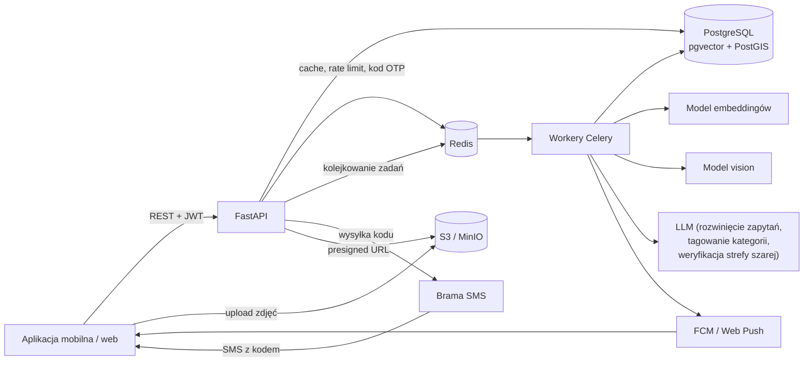
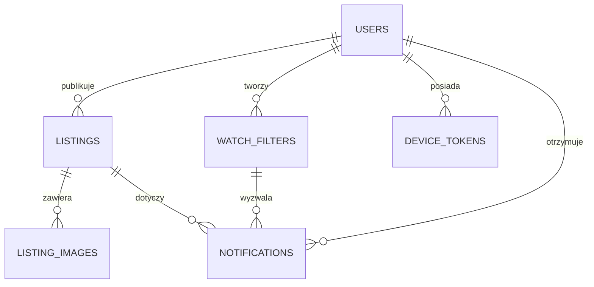
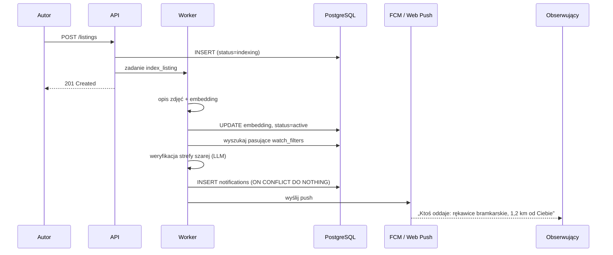

# 🗑️➡️🎁 Backend – aplikacja „Zanim zabierze śmieciarka”

Aplikacja skraca drogę między osobą, która oddaje rzeczy (zwykle wystawiane przed odbiorem gabarytów i ogłaszane na lokalnych grupach), a osobą, która ich szuka. Kluczowe funkcje backendu to **semantyczne wyszukiwanie ogłoszeń** oraz **filtry nasłuchiwania**, które wysyłają powiadomienie, gdy pojawi się przedmiot pasujący znaczeniowo (a nie tylko słowami) do tego, czego użytkownik szuka.

> Przykład: filtr „rzeczy do gry w piłkę nożną” powinien złapać ogłoszenie „rękawice bramkarskie”, „korki rozm. 38” albo „bramka ogrodowa”, mimo że żadne z tych ogłoszeń nie zawiera słów z filtra.

---

## Geneza projektu

Projekt powstał podczas hackathonu z myślą o społeczności grup **„Uwaga, Śmieciarka Jedzie”**, na których ludzie oddają rzeczy wystawiane przed wywozem gabarytów. Docelowo chcemy rozwijać aplikację we współpracy z fundacją prowadzącą te grupy.

**Pierwotny pomysł** zakładał nasłuchiwanie nowych postów bezpośrednio na grupach na Facebooku i filtrowanie ich treści. Zrezygnowaliśmy z niego, ponieważ:

- Graph API Facebooka nie daje praktycznego dostępu do treści postów w grupach, a dostęp przez aplikację wymagałby zgody administracji każdej grupy i przejścia weryfikacji Meta,
- scrapowanie prywatnych grup botami narusza regulamin Facebooka i nie jest opcją,
- nawet przy dostępie do API opóźnienia i limity zapytań uniemożliwiałyby powiadamianie w czasie rzeczywistym.
**Dlatego budujemy dedykowaną aplikację**, w której ogłoszenia trafiają do nas bezpośrednio. Daje to dwie przewagi nad szukaniem na grupach:

1. **Czas reakcji.** Przedmioty ze śmieciarki często znikają w ciągu kilku–kilkunastu minut. Powiadomienie wysyłamy w ciągu sekund od publikacji, a nie wtedy, gdy ktoś akurat przewinie grupę.
2. **Lepsze filtrowanie.** Zamiast ręcznie przeglądać wiele grup, użytkownik opisuje, czego szuka, a aplikacja dopasowuje ogłoszenia znaczeniowo, w wybranym przez niego obszarze, także poza grupą, do której należy (np. osoba z Warszawy może obserwować konkretne rzeczy oddawane w Krakowie).

---

## Spis treści

1. [Geneza projektu](#geneza-projektu)
2. [Założenia funkcjonalne](#1-założenia-funkcjonalne)
3. [Stack technologiczny](#2-stack-technologiczny)
4. [Architektura](#3-architektura)
5. [Model danych](#4-model-danych)
6. [Wyszukiwanie semantyczne](#5-wyszukiwanie-semantyczne)
7. [Filtry nasłuchiwania i powiadomienia](#6-filtry-nasłuchiwania-i-powiadomienia)
8. [Autoryzacja i uprawnienia](#7-autoryzacja-i-uprawnienia)
9. [API](#8-api)
10. [Obsługa zdjęć](#9-obsługa-zdjęć)
11. [Struktura projektu](#10-struktura-projektu)
12. [Uruchomienie lokalne](#11-uruchomienie-lokalne)
13. [Bezpieczeństwo i prywatność](#12-bezpieczeństwo-i-prywatność)
14. [Roadmapa](#13-roadmapa)

---

## 1. Założenia funkcjonalne


| Funkcja                              | Wymaga logowania | Opis                                                                        |
| ------------------------------------ | ---------------- | --------------------------------------------------------------------------- |
| Przeglądanie i wyszukiwanie ogłoszeń | ❌                | Wyszukiwanie semantyczne + filtrowanie po odległości                        |
| Dodawanie ogłoszenia                 | ✅                | Nazwa i lokalizacja (wymagane), zdjęcia i opis (opcjonalne)                 |
| Edycja / oznaczenie jako „oddane”    | ✅ (autor)        | Zmiana statusu ogłoszenia                                                   |
| Filtry nasłuchiwania                 | ✅                | Użytkownik może mieć wiele filtrów, każdy z własną lokalizacją i promieniem |
| Powiadomienia                        | ✅                | Push (mobile / web) + lista powiadomień w aplikacji                         |


**Obszar zainteresowania filtra** można ustawić na trzy sposoby, odwzorowując podział znany z grup śmieciarki:


| Tryb         | Przykład                                            | Zastosowanie                                                           |
| ------------ | --------------------------------------------------- | ---------------------------------------------------------------------- |
| `regions`    | „Warszawa” albo tylko „Warszawa – Mokotów, Ursynów” | Odpowiednik wyboru konkretnych grup i ich dzielnic                     |
| `radius`     | 5 km od mojego domu                                 | Gdy liczy się odległość, a nie granice administracyjne                 |
| `nationwide` | cała Polska                                         | Rzadkie lub cenne przedmioty, po które warto pojechać do innego miasta |


Użytkownik może mieć wiele filtrów, każdy z innym obszarem, np. „meble do salonu” tylko na Mokotowie i „gramofon” w całej Polsce.

**Czas reakcji jest wymaganiem, nie optymalizacją:** cel to powiadomienie push w **< 30 s** (p95) od opublikowania ogłoszenia. Na tym wymaganiu opierają się decyzje w sekcjach 3 i 6.

**Cykl życia ogłoszenia:** `active` → `reserved` → `given_away`, albo `active` → `expired`. Ogłoszenia wygasają automatycznie (domyślnie po 72 h, konfigurowalne), bo rzeczy przy śmietniku zwykle długo nie leżą.

---

## 2. Stack technologiczny


| Warstwa         | Technologia                                                                                           | Uzasadnienie                                                            |
| --------------- | ----------------------------------------------------------------------------------------------------- | ----------------------------------------------------------------------- |
| API             | **Python 3.12 + FastAPI**                                                                             | Asynchroniczność, automatyczna dokumentacja OpenAPI, dobry ekosystem ML |
| Baza danych     | **PostgreSQL 16**                                                                                     | Jedna baza na dane relacyjne, wektory i geolokalizację                  |
| Wektory         | **pgvector** (indeks HNSW)                                                                            | Wyszukiwanie po podobieństwie bez osobnej bazy wektorowej               |
| Geolokalizacja  | **PostGIS**                                                                                           | Zapytania „w promieniu X km” (`ST_DWithin`)                             |
| Kolejka / cache | **Redis**                                                                                             | Broker zadań, rate limiting, cache embeddingów zapytań                  |
| Workery         | **Celery** (lub ARQ)                                                                                  | Liczenie embeddingów, dopasowanie filtrów, wysyłka powiadomień          |
| Pliki           | **S3 / MinIO**                                                                                        | Zdjęcia ogłoszeń, upload przez presigned URL                            |
| Embeddingi      | **BGE-M3** lub **multilingual-e5-large** (self-hosted) albo API (np. OpenAI `text-embedding-3-small`) | Modele wielojęzyczne dobrze radzące sobie z polskim                     |
| Opis zdjęć      | Model vision (LLM multimodalny)                                                                       | Generuje opis tekstowy zdjęcia, gdy użytkownik nie dodał opisu          |
| Powiadomienia   | **Firebase Cloud Messaging** + Web Push                                                               | Android, iOS i przeglądarka                                             |
| SMS / OTP       | Brama SMS (np. Twilio, SMSAPI.pl)                                                                     | Wysyłka kodów weryfikacyjnych przy logowaniu przez numer telefonu       |
| Migracje / ORM  | **SQLAlchemy 2.0 + Alembic**                                                                          |                                                                         |
| Infrastruktura  | **Docker Compose** (dev), kontenery na produkcji                                                      |                                                                         |


---

## 3. Architektura




API pozostaje lekkie: wszystko, co kosztowne (embeddingi, analiza zdjęć, dopasowanie do filtrów, wysyłka push), dzieje się asynchronicznie w workerach. Ogłoszenie jest widoczne w wyszukiwaniu dopiero, gdy ma policzony embedding (status techniczny `indexing` → `active`), co zwykle trwa kilka sekund.

---

## 4. Model danych




### `users`


| Kolumna       | Typ         | Uwagi                                          |
| ------------- | ----------- | ---------------------------------------------- |
| id                | UUID PK          |                                                        |
| phone_number      | TEXT UNIQUE      | format E.164, np. `+48600000000`                      |
| phone_verified_at | TIMESTAMPTZ NULL | NULL do zakończenia weryfikacji OTP                   |
| display_name      | TEXT NULL        | opcjonalne, uzupełniane po rejestracji                |
| created_at        | TIMESTAMPTZ      |                                                        |
| is_banned         | BOOL             | moderacja                                              |


### `listings`


| Kolumna        | Typ                    | Uwagi                                                                |
| -------------- | ---------------------- | -------------------------------------------------------------------- |
| id             | UUID PK                |                                                                      |
| author_id      | UUID FK → users        |                                                                      |
| title          | TEXT NOT NULL          | nazwa przedmiotu                                                     |
| description    | TEXT NULL              | opcjonalny opis                                                      |
| image_caption  | TEXT NULL              | opis wygenerowany ze zdjęć                                           |
| location       | GEOGRAPHY(Point, 4326) | dokładna lokalizacja                                                 |
| location_label | TEXT                   | np. „Poznań, Jeżyce” – do wyświetlania                               |
| embedding      | VECTOR(1024)           | wymiar zależny od modelu                                             |
| search_tsv     | TSVECTOR               | do wyszukiwania pełnotekstowego (hybryda)                            |
| category_ids   | INT[]                  | kategorie przypisane przez LLM (patrz 5.3)                           |
| region_ids     | INT[]                  | ścieżka regionów, np. `[Warszawa, Mokotów]` (patrz sekcja `regions`) |
| status         | ENUM                   | `indexing`, `active`, `reserved`, `given_away`, `expired`, `removed` |
| expires_at     | TIMESTAMPTZ            |                                                                      |
| created_at     | TIMESTAMPTZ            |                                                                      |


Indeksy: HNSW na `embedding` (`vector_cosine_ops`), GiST na `location`, GIN na `search_tsv`, GIN na `category_ids` i `region_ids`, B-tree na `(status, created_at)`.

### `listing_images`


| Kolumna     | Typ      | Uwagi      |
| ----------- | -------- | ---------- |
| id          | UUID PK  |            |
| listing_id  | UUID FK  |            |
| storage_key | TEXT     | klucz w S3 |
| thumb_key   | TEXT     | miniatura  |
| position    | SMALLINT | kolejność  |


### `watch_filters`


| Kolumna        | Typ                   | Uwagi                                       |
| -------------- | --------------------- | ------------------------------------------- |
| id             | UUID PK               |                                             |
| user_id        | UUID FK               |                                             |
| query          | TEXT                  | treść wpisana przez użytkownika             |
| expanded_query | TEXT                  | rozwinięcie zapytania przez LLM (patrz 6.2) |
| embedding      | VECTOR(1024)          |                                             |
| category_ids   | INT[]                 | kategorie przypisane do filtra (patrz 5.3)  |
| area_type      | ENUM                  | `regions`, `radius`, `nationwide`           |
| center         | GEOGRAPHY(Point) NULL | środek obszaru (tryb `radius`)              |
| radius_m       | INT NULL              | promień w metrach (tryb `radius`)           |
| region_ids     | INT[] NULL            | wybrane regiony (tryb `regions`)            |
| min_score      | REAL NULL             | indywidualny próg czułości (opcjonalnie)    |
| is_active      | BOOL                  |                                             |
| created_at     | TIMESTAMPTZ           |                                             |


Indeksy: HNSW na `embedding`, GiST na `center`, GIN na `region_ids` i `category_ids`.

### `regions`

Hierarchia obszarów odpowiadająca grupom śmieciarki: miasto lub powiat → dzielnice.


| Kolumna   | Typ                     | Uwagi                                     |
| --------- | ----------------------- | ----------------------------------------- |
| id        | SERIAL PK               |                                           |
| parent_id | INT FK NULL             | np. „Mokotów” → „Warszawa”                |
| name      | TEXT                    |                                           |
| slug      | TEXT UNIQUE             | `warszawa-mokotow`                        |
| boundary  | GEOGRAPHY(MultiPolygon) | granice, np. z danych PRG / OpenStreetMap |


Przy indeksowaniu ogłoszenia worker przypisuje mu najmniejszy pasujący region (`ST_Contains`), a w tabeli `listings` zapisuje `region_ids INT[]` z całą ścieżką (np. `[Warszawa, Mokotów]`). Filtr ustawiony na „Warszawa” łapie wtedy wszystkie dzielnice bez dodatkowej logiki.

### `categories`

Stała taksonomia przedmiotów (ok. 100–200 pozycji, dwa poziomy), np. `sport → piłka nożna`, `meble → krzesła`. Używana do tagowania (patrz 5.3).

| Kolumna   | Typ         | Uwagi                       |
| --------- | ----------- | --------------------------- |
| id        | SERIAL PK   |                             |
| parent_id | INT FK NULL | np. „piłka nożna” → „sport” |
| name      | TEXT        |                             |
| slug      | TEXT UNIQUE | `sport-pilka-nozna`         |

### `notifications`


| Kolumna    | Typ              | Uwagi        |
| ---------- | ---------------- | ------------ |
| id         | UUID PK          |              |
| user_id    | UUID FK          |              |
| listing_id | UUID FK          |              |
| filter_id  | UUID FK          |              |
| score      | REAL             | podobieństwo |
| read_at    | TIMESTAMPTZ NULL |              |
| created_at | TIMESTAMPTZ      |              |


Ograniczenie `UNIQUE(user_id, listing_id)`: użytkownik dostaje jedno powiadomienie o danym ogłoszeniu, nawet jeśli pasuje ono do kilku jego filtrów. Przy kilku pasujących filtrach `filter_id` i `score` odpowiadają temu, który trafił do `INSERT ... ON CONFLICT DO NOTHING` jako pierwszy (patrz 6.4) — nie ma gwarancji, że to filtr z najwyższym podobieństwem.

### `device_tokens`

Tokeny FCM / subskrypcje Web Push przypisane do użytkownika.

| Kolumna       | Typ         | Uwagi                          |
| ------------- | ----------- | ------------------------------- |
| user_id       | UUID FK     |                                 |
| platform      | TEXT        | `android`, `ios`, `web`         |
| token         | TEXT PK     | token FCM / endpoint Web Push   |
| last_seen_at  | TIMESTAMPTZ | do czyszczenia nieużywanych     |

---

## 5. Wyszukiwanie semantyczne

### 5.1 Indeksowanie ogłoszenia

1. Użytkownik tworzy ogłoszenie → status `indexing`.
2. Worker, jeśli są zdjęcia, generuje krótki opis tekstowy modelem vision (`image_caption`), np. „para czarnych rękawic bramkarskich z zapięciem na rzep”.
3. Worker buduje tekst do embeddingu:

```
   {title}. {description}. {image_caption}
```

4. Liczy embedding, przypisuje regiony (`ST_Contains`) i kategorie (LLM), zapisuje `embedding` i `search_tsv`, ustawia status `active`.
5. Odpala dopasowanie do filtrów (sekcja 6).

> Modele z rodziny E5 wymagają prefiksów: `passage:` dla ogłoszeń i `query:` dla zapytań oraz filtrów. Należy to obsłużyć w jednym miejscu (`services/embeddings.py`).

### 5.2 Zapytanie wyszukiwania

Wyszukiwanie jest **hybrydowe**: łączy podobieństwo wektorowe z dopasowaniem pełnotekstowym, co pomaga przy nazwach własnych i konkretnych słowach („IKEA Kallax”), z którymi same embeddingi radzą sobie słabiej.

```sql
WITH semantic AS (
  SELECT id, 1 - (embedding <=> :query_vec) AS sem_score
  FROM listings
  WHERE status = 'active'
    AND ST_DWithin(location, :user_point, :radius_m)
  ORDER BY embedding <=> :query_vec
  LIMIT 100
),
lexical AS (
  SELECT id, ts_rank(search_tsv, plainto_tsquery('simple', :q)) AS lex_score
  FROM listings
  WHERE status = 'active'
    AND ST_DWithin(location, :user_point, :radius_m)
    AND search_tsv @@ plainto_tsquery('simple', :q)
  LIMIT 100
)
SELECT ... -- połączenie wyników metodą Reciprocal Rank Fusion (RRF)
```

Wyniki można dodatkowo sortować z uwzględnieniem odległości i świeżości ogłoszenia (rzeczy wystawione godzinę temu są cenniejsze niż te sprzed dwóch dni).

### 5.3 Tagowanie kategoriami (uzupełnienie wektorów)

Rozważaliśmy dwa podejścia do pytania „czy rękawice bramkarskie należą do rzeczy do gry w piłkę nożną?”:


| Podejście                                             | Zalety                                                                     | Wady                                                                         |
| ----------------------------------------------------- | -------------------------------------------------------------------------- | ---------------------------------------------------------------------------- |
| **Tagowanie** (LLM przypisuje kategorie z taksonomii) | Przewidywalne, łatwe do wyjaśnienia użytkownikowi, tanie przy porównywaniu | Sztywne; nie obsłuży potrzeb spoza taksonomii („coś na balkon w stylu boho”) |
| **Wyszukiwanie wektorowe**                            | Elastyczne, rozumie dowolne opisy potrzeb                                  | Wymaga kalibracji progów, trudniej wytłumaczyć fałszywe trafienia            |


Stosujemy **oba jednocześnie**:

- przy indeksowaniu ogłoszenia LLM przypisuje mu 1–3 kategorie (`listings.category_ids`),
- przy tworzeniu filtra LLM przypisuje mu kategorie, jeśli potrzeba jest „kategoryczna” (np. „rzeczy do gry w piłkę nożną” → `sport/piłka nożna`); dla opisów nietypowych lista pozostaje pusta,
- wspólna kategoria **podnosi** wynik dopasowania (np. obniża wymagany próg), ale nie jest warunkiem koniecznym; dopasowanie wektorowe działa także bez niej.
Kategorie przydają się też w interfejsie: jako szybkie filtry w wyszukiwarce i ikony na liście ogłoszeń.

---

## 6. Filtry nasłuchiwania i powiadomienia

### 6.1 Idea: odwrócone wyszukiwanie

Zamiast przy każdym nowym ogłoszeniu przepuszczać przez nie wszystkie filtry po kolei, **filtry są przechowywane jako wektory** i to nowe ogłoszenie staje się „zapytaniem” do tabeli `watch_filters`. Dzięki indeksowi HNSW i PostGIS skaluje się to do setek tysięcy filtrów.

```sql
SELECT f.id, f.user_id,
       1 - (f.embedding <=> :listing_vec) AS score,
       f.category_ids && :listing_categories AS category_hit
FROM watch_filters f
WHERE f.is_active
  AND f.user_id <> :listing_author_id
  AND (
        f.area_type = 'nationwide'
     OR (f.area_type = 'regions' AND f.region_ids && :listing_region_ids)
     OR (f.area_type = 'radius'  AND ST_DWithin(f.center, :listing_point, f.radius_m))
  )
  AND 1 - (f.embedding <=> :listing_vec) >=
      COALESCE(f.min_score, :default_threshold)
      - CASE WHEN f.category_ids && :listing_categories THEN :category_bonus ELSE 0 END
ORDER BY f.embedding <=> :listing_vec
LIMIT 500;
```

Filtry ogólnopolskie i regionalne sprawiają, że ogłoszenie z Krakowa może trafić do osoby, która nigdy nie należała do krakowskiej grupy. To główna wartość dodana względem przeglądania grup z osobna.

### 6.2 Rozwinięcie zapytania filtra

Krótkie, ogólne filtry („rzeczy do gry w piłkę nożną”) mają embedding odległy od konkretnych przedmiotów. Dlatego przy tworzeniu filtra LLM generuje rozwinięcie (`expanded_query`), np.:

> rzeczy do gry w piłkę nożną: piłka, korki, buty piłkarskie, rękawice bramkarskie, ochraniacze na piszczele, getry, bramka, siatka do bramki, strój piłkarski, pachołki treningowe

Embedding liczony jest z rozwiniętego tekstu. Użytkownik widzi wyłącznie swoje oryginalne zapytanie.

### 6.3 Weryfikacja kandydatów (opcjonalna, zalecana)

Próg podobieństwa zawsze daje kompromis między fałszywymi alarmami a pominięciami. Aby nie spamować użytkowników:

- kandydaci z wynikiem **≥ próg wysoki** → powiadomienie od razu,
- kandydaci w **strefie szarej** (próg niski ≤ score < próg wysoki) → krótka weryfikacja przez LLM: „Czy ogłoszenie X pasuje do potrzeby Y? Odpowiedz tak/nie”,
- poniżej progu niskiego → odrzucenie.
Wartości progów zależą od modelu embeddingów i **trzeba je skalibrować** na zestawie testowych par (ogłoszenie, filtr, pasuje/nie pasuje).

### 6.4 Przepływ




### 6.5 Ochrona przed spamem

- deduplikacja: jedno powiadomienie na parę (użytkownik, ogłoszenie),
- limit powiadomień push na użytkownika (np. 20 / h); nadmiarowe trafiają tylko do listy w aplikacji lub do zbiorczego podsumowania,
- godziny ciszy ustawiane przez użytkownika,
- limit liczby filtrów na konto (np. 10).
Limity nie mogą jednak opóźniać pierwszego powiadomienia o nowym przedmiocie, bo przy śmieciarce liczą się minuty. Zbiorcze podsumowania dotyczą wyłącznie nadmiarowych powiadomień.

### 6.6 Budżet czasowy (cel: < 30 s od publikacji do push)


| Etap                            | Budżet  | Jak go dotrzymać                                                                                                           |
| ------------------------------- | ------- | -------------------------------------------------------------------------------------------------------------------------- |
| Zapis ogłoszenia i kolejkowanie | < 0,5 s | Zadanie trafia do osobnej kolejki o wysokim priorytecie (`realtime`), oddzielonej od zadań w tle (miniatury, reindeksacja) |
| Embedding tekstu                | < 1 s   | Model trzymany w pamięci workera lub szybkie API; **opis zdjęć nie blokuje pierwszego dopasowania**                        |
| Dopasowanie do filtrów          | < 0,5 s | Indeks HNSW + warunki obszaru w jednym zapytaniu                                                                           |
| Weryfikacja LLM strefy szarej   | < 5 s   | Wywołania równoległe z twardym timeoutem; po przekroczeniu decyduje próg                                                   |
| Wysyłka push                    | < 2 s   | FCM z priorytetem `high`, wysyłka wsadowa (multicast)                                                                      |


Dopasowanie odbywa się dwuetapowo: **natychmiast** na podstawie tytułu i opisu, a **ponownie** po wygenerowaniu opisu zdjęć (zwykle kilka–kilkanaście sekund później). Drugi przebieg powiadamia tylko nowe osoby, dzięki ograniczeniu `UNIQUE(user_id, listing_id)`.

Czas od publikacji do wysłania push mierzymy jako metrykę (`notification_latency_seconds`) i alarmujemy po przekroczeniu celu.

---

## 7. Autoryzacja i uprawnienia

- **Logowanie przez numer telefonu (OTP SMS), jedyna metoda.** Użytkownik podaje numer → backend wysyła 6-cyfrowy kod SMS (TTL ok. 5 min) → użytkownik wpisuje kod → backend weryfikuje i wydaje JWT. Nowy numer = automatyczna rejestracja przy pierwszej udanej weryfikacji.
- **Stan kodu OTP żyje w Redis**, nie w Postgresie: klucz per numer telefonu, wartość to hash kodu + licznik prób, TTL = `OTP_TTL_SECONDS`. Krótkotrwałe dane, nie potrzebują trwałej tabeli.
- **Ochrona przed OTP-bombingiem:** rate limiting per numer i per IP na wysyłkę kodu, CAPTCHA przed wysyłką, limit prób weryfikacji kodu (np. 5, `OTP_MAX_ATTEMPTS`), blokada numeru po przekroczeniu.
- **Access token** JWT (krótki, ok. 15 min) + **refresh token** (rotowany, przechowywany jako hash w bazie, z możliwością unieważnienia).
- Wyszukiwanie i przeglądanie są publiczne. Publikowanie, filtry i powiadomienia wymagają zalogowania.
- Edycję i usuwanie ogłoszenia może wykonać tylko jego autor (lub moderator).
- Rate limiting w Redis, ostrzejszy dla wysyłki kodu OTP i weryfikacji.

---

## 8. API

Pełna dokumentacja generuje się automatycznie pod `/docs` (Swagger) i `/redoc`.

### Auth


| Metoda | Ścieżka                | Opis                                                               |
| ------ | ---------------------- | ------------------------------------------------------------------- |
| POST   | `/auth/phone/start`    | Wysyła kod OTP SMS na podany numer                                 |
| POST   | `/auth/phone/verify`   | Weryfikuje kod, zwraca access + refresh token (rejestruje, jeśli numer nowy) |
| POST   | `/auth/refresh`        | Odświeżenie tokenu                                                 |
| POST   | `/auth/logout`   | Unieważnienie refresh tokenu             |
| GET    | `/me`            | Profil zalogowanego użytkownika          |

Przykładowe ciała:

```json
// POST /auth/phone/start
{ "phone_number": "+48600000000" }
```

```json
// POST /auth/phone/verify
{ "phone_number": "+48600000000", "code": "123456" }
```


### Ogłoszenia


| Metoda | Ścieżka                                 | Auth    | Opis                                |
| ------ | --------------------------------------- | ------- | ----------------------------------- |
| GET    | `/listings/search?q=&lat=&lng=&radius=` | ❌       | Wyszukiwanie semantyczne            |
| GET    | `/listings/nearby?lat=&lng=&radius=`    | ❌       | Najnowsze w okolicy (bez zapytania) |
| GET    | `/listings/{id}`                        | ❌       | Szczegóły ogłoszenia                |
| POST   | `/listings`                             | ✅       | Utworzenie ogłoszenia               |
| PATCH  | `/listings/{id}`                        | ✅ autor | Edycja                              |
| POST   | `/listings/{id}/status`                 | ✅ autor | `reserved` / `given_away`           |
| DELETE | `/listings/{id}`                        | ✅ autor | Usunięcie                           |
| POST   | `/listings/{id}/images/upload-url`      | ✅ autor | Presigned URL do uploadu zdjęcia    |
| POST   | `/listings/{id}/report`                 | ✅       | Zgłoszenie do moderacji             |


Przykładowe ciało `POST /listings`:

```json
{
  "title": "Rękawice bramkarskie",
  "description": "Rozmiar 8, trochę zużyte, ale całe",
  "location": { "lat": 52.4064, "lng": 16.9252 },
  "location_label": "Poznań, Jeżyce"
}
```

### Filtry nasłuchiwania


| Metoda | Ścieżka                 | Opis                                                    |
| ------ | ----------------------- | ------------------------------------------------------- |
| GET    | `/filters`              | Lista filtrów użytkownika                               |
| POST   | `/filters`              | Utworzenie filtra                                       |
| PATCH  | `/filters/{id}`         | Edycja (treść, promień, aktywność)                      |
| DELETE | `/filters/{id}`         | Usunięcie                                               |
| GET    | `/filters/{id}/preview` | Podgląd: które aktualne ogłoszenia pasowałyby do filtra |


Przykładowe ciała `POST /filters`:

```json
{
  "query": "rzeczy do gry w piłkę nożną",
  "area": { "type": "regions", "region_slugs": ["warszawa-mokotow", "warszawa-ursynow"] }
}
```

```json
{
  "query": "gramofon",
  "area": { "type": "nationwide" }
}
```

```json
{
  "query": "krzesła drewniane",
  "area": { "type": "radius", "center": { "lat": 52.4064, "lng": 16.9252 }, "radius_m": 5000 }
}
```

### Słowniki


| Metoda | Ścieżka            | Opis                                                   |
| ------ | ------------------ | ------------------------------------------------------ |
| GET    | `/regions?parent=` | Drzewo regionów (miasta → dzielnice) do wyboru obszaru |
| GET    | `/categories`      | Taksonomia kategorii                                   |


### Powiadomienia


| Metoda | Ścieżka                    | Opis                                   |
| ------ | -------------------------- | -------------------------------------- |
| GET    | `/notifications`           | Lista powiadomień (paginacja kursorem) |
| POST   | `/notifications/{id}/read` | Oznaczenie jako przeczytane            |
| POST   | `/devices`                 | Rejestracja tokenu push                |
| DELETE | `/devices/{token}`         | Wyrejestrowanie urządzenia             |


---

## 9. Obsługa zdjęć

1. Klient prosi o presigned URL (`/listings/{id}/images/upload-url`) i wysyła plik bezpośrednio do S3, z pominięciem API.
2. Worker po uploadzie:
  - weryfikuje typ i rozmiar pliku (JPEG / PNG / WebP / HEIC, maks. ok. 10 MB, maks. 6 zdjęć),
  - **usuwa metadane EXIF** (w tym współrzędne GPS!),
  - generuje miniaturę i wersję WebP,
  - generuje opis zdjęcia modelem vision i przelicza embedding ogłoszenia,
  - opcjonalnie wykonuje automatyczną moderację treści.

---

## 10. Struktura projektu

```
backend/
├── app/
│   ├── main.py                 # inicjalizacja FastAPI
│   ├── config.py               # ustawienia (pydantic-settings)
│   ├── api/
│   │   ├── auth.py
│   │   ├── listings.py
│   │   ├── filters.py
│   │   ├── notifications.py
│   │   └── deps.py             # zależności: sesja DB, bieżący użytkownik
│   ├── models/                 # modele SQLAlchemy
│   ├── schemas/                # schematy Pydantic (request/response)
│   ├── services/
│   │   ├── embeddings.py       # abstrakcja nad modelem embeddingów
│   │   ├── vision.py           # opisy zdjęć
│   │   ├── search.py           # wyszukiwanie hybrydowe
│   │   ├── matching.py         # dopasowanie ogłoszeń do filtrów
│   │   ├── query_expansion.py  # rozwijanie zapytań filtrów
│   │   ├── storage.py          # S3 / MinIO
│   │   ├── push.py             # FCM / Web Push
│   │   └── sms.py              # brama SMS, wysyłka i weryfikacja kodów OTP
│   ├── workers/
│   │   ├── celery_app.py
│   │   └── tasks.py            # index_listing, match_filters, send_push, expire_listings
│   └── core/
│       ├── security.py         # JWT, generowanie i weryfikacja kodów OTP
│       └── rate_limit.py
├── migrations/                 # Alembic
├── tests/
│   ├── unit/
│   ├── integration/
│   └── matching_eval/          # zestaw par do kalibracji progów
├── docker-compose.yml
├── Dockerfile
├── pyproject.toml
└── .env.example
```

---

## 11. Uruchomienie lokalne

```bash
cp .env.example .env
docker compose up -d          # postgres (pgvector + postgis), redis, minio
alembic upgrade head
uvicorn app.main:app --reload
celery -A app.workers.celery_app worker -B --loglevel=info
```

> **Dev mode OTP:** lokalnie, gdy `SMS_PROVIDER_API_KEY` nie jest ustawiony, kod OTP jest logowany do konsoli/logów workera zamiast wysyłany SMS-em — bez tego każdy test logowania kosztowałby prawdziwy SMS.

Najważniejsze zmienne środowiskowe:


| Zmienna                                                      | Opis                                                   |
| ------------------------------------------------------------ | ------------------------------------------------------ |
| `DATABASE_URL`                                               | połączenie z PostgreSQL                                |
| `REDIS_URL`                                                  | połączenie z Redis                                     |
| `S3_ENDPOINT`, `S3_BUCKET`, `S3_ACCESS_KEY`, `S3_SECRET_KEY` | przechowywanie zdjęć                                   |
| `JWT_SECRET`, `JWT_ACCESS_TTL`, `JWT_REFRESH_TTL`            | autoryzacja                                            |
| `SMS_PROVIDER_API_KEY`, `SMS_PROVIDER_SENDER`                | brama SMS do wysyłki kodów OTP                         |
| `OTP_TTL_SECONDS`, `OTP_MAX_ATTEMPTS`                        | czas życia kodu OTP i limit prób weryfikacji           |
| `EMBEDDING_PROVIDER`, `EMBEDDING_MODEL`, `EMBEDDING_DIM`     | konfiguracja embeddingów                               |
| `LLM_API_KEY`                                                | rozwijanie zapytań, opisy zdjęć, weryfikacja dopasowań |
| `MATCH_THRESHOLD_LOW`, `MATCH_THRESHOLD_HIGH`                | progi dopasowania filtrów                              |
| `LISTING_TTL_HOURS`                                          | czas życia ogłoszenia                                  |
| `FCM_CREDENTIALS`, `VAPID_PUBLIC_KEY`, `VAPID_PRIVATE_KEY`   | powiadomienia push                                     |


> Zmiana modelu embeddingów wymaga przeliczenia wektorów wszystkich ogłoszeń **i** filtrów (zadanie `reindex_all`), ponieważ wektory z różnych modeli nie są porównywalne.

---

## 12. Bezpieczeństwo i prywatność

- **Numer telefonu:** służy wyłącznie do logowania (OTP) i nigdy nie jest zwracany w publicznych endpointach (`/listings/*`, `/filters/*`). Kontakt między dawcą i odbiorcą idzie przez przyszły czat (patrz Roadmapa), nie przez numer.
- **Lokalizacja:** dokładny punkt widzi tylko autor. Publicznie zwracamy współrzędne zaokrąglone (np. do ok. 200 m) oraz `location_label`. Dokładny adres autor może przekazać w kontakcie.
- **EXIF:** usuwany ze wszystkich zdjęć przed publikacją.
- **RODO:** endpoint eksportu i usunięcia konta wraz z ogłoszeniami, filtrami i powiadomieniami.
- **Moderacja:** zgłoszenia ogłoszeń, blokowanie kont, automatyczne wykrywanie spamu (np. wiele identycznych ogłoszeń w krótkim czasie).
- **Walidacja:** limity długości tytułu i opisu, sanityzacja treści.

---

## 13. Roadmapa

- **MVP:** auth, ogłoszenia, wyszukiwanie semantyczne, filtry (regiony / promień / cała Polska), push w < 30 s
- Taksonomia kategorii i tagowanie ogłoszeń przez LLM
- Import granic regionów odpowiadających grupom śmieciarki (PRG / OpenStreetMap)
- **Współpraca z fundacją „Uwaga, Śmieciarka Jedzie”:** wspólny branding, promocja aplikacji na grupach, mapowanie regionów 1:1 na istniejące grupy
- Przycisk „udostępnij na grupie śmieciarki” – gotowy tekst i link do ogłoszenia do wklejenia na Facebooku (bez automatycznego publikowania przez API)
- Opisy zdjęć modelem vision i wyszukiwanie po zawartości zdjęć
- Weryfikacja dopasowań przez LLM i kalibracja progów na danych
- Feedback „to nie to, czego szukam” przy powiadomieniu → automatyczne dostrajanie progu filtra
- Czat między dawcą a odbiorcą (WebSocket)
- Rezerwacja przedmiotu przez odbiorcę
- Integracja z harmonogramami odbioru odpadów wielkogabarytowych w gminach (automatyczna data wygaśnięcia ogłoszeń)
- ~~Pobieranie postów z grup na Facebooku~~ – porzucone (patrz [Geneza projektu](#geneza-projektu)); wrócimy do tematu tylko przy oficjalnym dostępie uzgodnionym z fundacją i Meta

