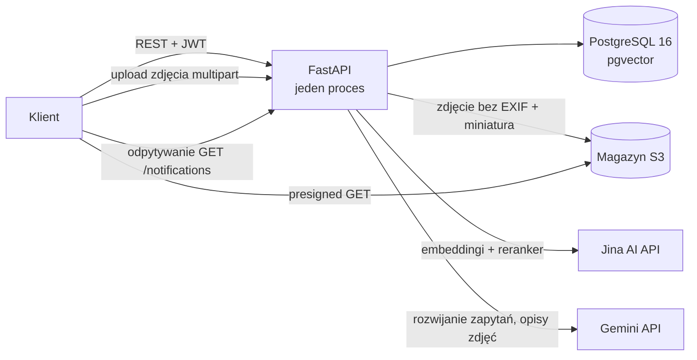
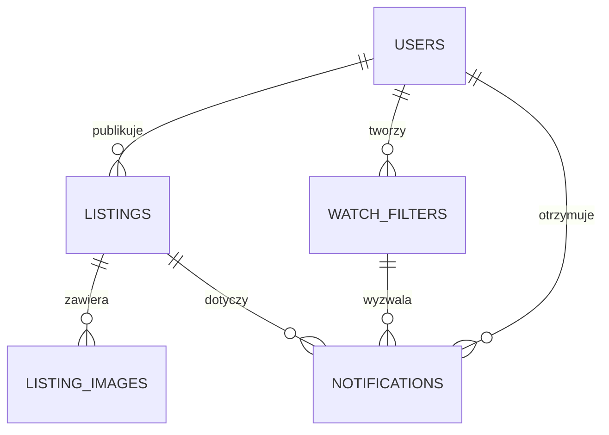

# Backend – stan obecny

Opis tego, co faktycznie jest w katalogu `backend/` na dzisiaj. Dokument
celowo trzymany osobno od [specyfikacji](../../README.md): specyfikacja mówi,
jak backend ma wyglądać docelowo, ten plik mówi, jak wygląda teraz. Jeśli
widzisz rozbieżność, to prawdę o kodzie ma ten plik, a nie specyfikacja.

Jak to uruchomić: [`uruchomienie.md`](uruchomienie.md).

**Status w jednym zdaniu:** działający prototyp jednego procesu FastAPI nad
PostgreSQL i magazynem obiektów, który realizuje pełną ścieżkę demo —
logowanie, dodanie ogłoszenia ze zdjęciami, wyszukiwanie semantyczne, filtr
nasłuchiwania i powiadomienie w aplikacji — bez warstwy asynchronicznej, bez
pushy i bez prawdziwych SMS-ów.

Rozmiar: około 1740 linii Pythona w `app/`, cztery migracje Alembica, zero
testów.

---

## Spis treści

1. [Co działa od końca do końca](#co-działa-od-końca-do-końca)
2. [Stack faktyczny](#stack-faktyczny)
3. [Architektura](#architektura)
4. [Struktura katalogów](#struktura-katalogów)
5. [Model danych](#model-danych)
6. [Wyszukiwanie](#wyszukiwanie)
7. [Zdjęcia](#zdjęcia)
8. [Dopasowanie filtrów i powiadomienia](#dopasowanie-filtrów-i-powiadomienia)
9. [Dlaczego klucze są wymagane](#dlaczego-klucze-są-wymagane)
10. [Autoryzacja](#autoryzacja)
11. [API](#api)
12. [Prywatność](#prywatność)
13. [Czego brakuje względem specyfikacji](#czego-brakuje-względem-specyfikacji)
14. [Pierwsze rzeczy do zrobienia](#pierwsze-rzeczy-do-zrobienia)

---

## Co działa od końca do końca

Ścieżka, którą można przejść curl-em i która kończy się powiadomieniem
(komendy: [`uruchomienie.md`](uruchomienie.md#pełny-przepływ-ogłoszenie-wyszukiwanie-powiadomienie)):

1. Logowanie numerem telefonu ze stałym kodem `123456`, z automatyczną
   rejestracją nowego numeru i wydaniem pary tokenów JWT.
2. Dodanie ogłoszenia z tytułem, opcjonalnym opisem i lokalizacją. Embedding
   liczy się w tym samym żądaniu, więc ogłoszenie jest od razu wyszukiwalne.
3. Wyszukiwanie semantyczne bez logowania, opcjonalnie ograniczone promieniem
   od podanego punktu.
4. Dodanie do ogłoszenia maksymalnie 6 zdjęć, po jednym na żądanie. Każde
   przechodzi przez API, traci EXIF, dostaje miniaturę i opis modelu vision,
   po czym ogłoszenie jest przeliczane i dopasowywane ponownie.
5. Utworzenie filtra nasłuchiwania z obszarem `radius` albo `nationwide`.
   Zapytanie filtra jest rozwijane przez LLM i to rozwinięcie jest embedowane.
6. Dopasowanie nowego ogłoszenia do zapisanych filtrów i zapis powiadomień
   w bazie. Powiadomienie odczytuje się przez `GET /notifications` —
   **nie ma wysyłki push**, klient musi odpytywać.

Autor nigdy nie dostaje powiadomienia o własnym ogłoszeniu, więc do testu
dopasowania potrzebne są dwa konta.

Zmierzone na tej ścieżce: ogłoszenie „Rzeczy z piwnicy" bez słowa o sporcie
nie pasowało do filtra „rzeczy do gry w piłkę nożną" i nie dało powiadomienia.
Po wgraniu zdjęcia piłki opis z modelu vision wszedł do tekstu embeddingu
i powiadomienie powstało, z wynikiem rerankera `0.267` przy progu `0.10`.
To jest cała wartość opisów zdjęć: ogłoszenie staje się znajdowalne przez to,
co widać na obrazku, a nie tylko przez to, co autor napisał.

---

## Stack faktyczny

| Warstwa | Specyfikacja | Stan obecny |
| ------- | ------------ | ----------- |
| API | Python 3.12 + FastAPI | tak, FastAPI 0.142, obraz na Pythonie 3.13 |
| Baza | PostgreSQL 16 | tak, obraz `pgvector/pgvector:pg16` |
| Wektory | pgvector z indeksem HNSW | pgvector tak, **bez indeksu** (skan sekwencyjny) |
| Geolokalizacja | PostGIS (`ST_DWithin`) | **brak**, odległość liczona wzorem haversine na kolumnach `lat`/`lng` typu `float` |
| Kolejka / cache | Redis | **brak** |
| Workery | Celery | **brak**, wszystko w procesie API |
| Pliki | S3 / MinIO | magazyn S3 jest, w compose jako **LocalStack**, nie MinIO (patrz [Zdjęcia](#zdjęcia)) |
| Embeddingi | BGE-M3 / multilingual-e5-large | `jina-embeddings-v3` przez API (1024 wymiary), awaryjnie lokalny `fastembed` (384) |
| Decyzja o dopasowaniu | próg podobieństwa + opcjonalny LLM | `jina-reranker-v2-base-multilingual`, próg na wyniku rerankera |
| Rozwijanie zapytań | LLM | Gemini (`gemini-flash-lite-latest`) przez REST |
| Opis zdjęć | model vision | Gemini (`gemini-flash-lite-latest`), opis per zdjęcie wchodzi do tekstu embeddingu |
| Powiadomienia | FCM + Web Push | **brak**, tylko wiersze w tabeli `notifications` |
| SMS / OTP | textbee.dev → SMSAPI.pl | **brak**, tryb `OTP_MOCK` ze stałym kodem |
| ORM / migracje | SQLAlchemy 2.0 + Alembic | tak, SQLAlchemy async z `asyncpg` |
| Infrastruktura | Docker Compose | tak, cztery serwisy: `postgres`, `s3`, `migrate`, `api` |

Żadna z usług AI nie jest self-hostowana: embeddingi, reranker, rozwijanie
zapytań i opisy zdjęć to wywołania HTTP do Jiny i Google. Lokalnie działają
tylko PostgreSQL, magazyn obiektów i samo API.

---

## Architektura



Zdjęcia idą **do** magazynu przez API, a czytane są **z** magazynu wprost
przez klienta po presigned URL. Upload nie omija API celowo — uzasadnienie
w sekcji [Zdjęcia](#zdjęcia).

Główna różnica wobec architektury ze specyfikacji: **nie ma workerów**.
Embedding ogłoszenia i całe dopasowanie do filtrów wykonują się synchronicznie
w obsłudze `POST /listings`, przed zwróceniem odpowiedzi 201. To samo dotyczy
przetwarzania zdjęcia, opisu vision i przeliczenia ogłoszenia w obsłudze
`POST /listings/{id}/images`. Konsekwencje:

- Status techniczny `indexing` nie jest używany — ogłoszenie powstaje od razu
  jako `active`, bo embedding jest już policzony.
- Czas odpowiedzi `POST /listings` zawiera jedno wywołanie embeddingu oraz do
  `MATCH_CANDIDATE_LIMIT` (domyślnie 100) wywołań rerankera, puszczanych po 10
  równolegle. Przy wielu pasujących obszarowo filtrach to sekundy, nie
  milisekundy, a timeout pojedynczego wywołania to 20 s.
- Awaria Jiny nie opóźnia powiadomień, bo nie ma kolejki — rozkłada się na dwa
  różne objawy. Nieudany embedding przerywa `POST /listings` błędem 500
  i ogłoszenie nie powstaje, bo embedding liczy się przed zapisem. Nieudane
  wywołanie rerankera jest łapane i logowane, więc ogłoszenie powstaje
  normalnie, a cicho gubi się tylko powiadomienie dla tego kandydata.
- Ogłoszenie jest commitowane **przed** dopasowaniem, a samo dopasowanie nie
  jest osłonięte `try`. Jeśli padnie z innego powodu niż reranker, klient
  dostaje 500, choć ogłoszenie jest już trwale w bazie. Ponowienie żądania
  utworzy duplikat, więc klient nie powinien powtarzać `POST /listings`
  automatycznie.
- Upload zdjęcia trwa dłużej niż dodanie ogłoszenia, bo w jednym żądaniu
  siedzi dekodowanie i dwukrotne kodowanie WebP, dwa zapisy do magazynu,
  wywołanie modelu vision, ponowny embedding i drugi przebieg dopasowania.
  Zmierzone na syntetycznym zdjęciu 2400×1600: **3,0 s**. W przeciwieństwie do
  dodania ogłoszenia to żądanie jest osłonięte: błąd dopasowania po uploadzie
  jest łapany i logowany, więc zdjęcie nie przepada z powodu awarii Jiny.

Przy skali demo to jest akceptowalne i pozwala pokazać działanie bez
uruchamiania brokera i workerów. Przy jakimkolwiek realnym ruchu trzeba to
wynieść do kolejki, bo cel „push w < 30 s” ze specyfikacji nie ma tu jeszcze
ani kolejki, ani pushy, ani pomiaru.

---

## Struktura katalogów

```
backend/
├── app/
│   ├── main.py                  # FastAPI, montowanie routerów, /health
│   ├── config.py                # pydantic-settings, wszystkie progi i klucze
│   ├── db.py                    # silnik async, sesja, Base
│   ├── api/
│   │   ├── deps.py              # get_current_user, get_optional_user
│   │   ├── auth.py
│   │   ├── listings.py
│   │   ├── images.py            # upload i usuwanie zdjęć ogłoszenia
│   │   ├── filters.py
│   │   └── notifications.py
│   ├── models/                  # User, Listing, ListingImage, WatchFilter, Notification
│   ├── schemas/                 # Pydantic: auth, listing, filter, notification
│   ├── services/
│   │   ├── embeddings.py        # wybór providera i tekst do embeddingu
│   │   ├── jina.py              # klient embeddingów i rerankera
│   │   ├── query_expansion.py   # Gemini
│   │   ├── vision.py            # Gemini, opis zdjęcia
│   │   ├── images.py            # walidacja, usuwanie EXIF, WebP, miniatura
│   │   ├── storage.py           # klient S3 (boto3), presigned URL
│   │   ├── matching.py          # odwrócone wyszukiwanie, dwa etapy
│   │   └── geo.py               # haversine jako wyrażenie SQL
│   └── core/
│       └── security.py          # tokeny JWT, stała MOCK_OTP_CODE
├── migrations/                  # Alembic, cztery wersje
├── docs/
├── alembic.ini
├── docker-compose.yml
├── Dockerfile
├── requirements.txt             # nie pyproject.toml
└── .env.example
```

Względem struktury ze specyfikacji nie ma katalogów `workers/` i `tests/` ani
plików `services/search.py`, `services/push.py`, `services/sms.py`
i `core/rate_limit.py`. Wyszukiwanie nie ma osobnego serwisu — zapytanie jest
zbudowane wprost w `app/api/listings.py`.

---

## Model danych

Pięć tabel. Brakuje `regions`, `categories` i `device_tokens`.



### `users`

Zgodnie ze specyfikacją: `id`, `phone_number` (unikalny), `phone_verified_at`,
`display_name`, `is_banned`, `created_at`. `is_banned` jest sprawdzane przy
autoryzacji, ale nie ma endpointu, który je ustawia.

### `listings`

| Kolumna | Typ | Uwagi |
| ------- | --- | ----- |
| `id` | UUID PK | |
| `author_id` | UUID FK → `users` | |
| `title` | TEXT NOT NULL | maks. 120 znaków (walidacja Pydantic) |
| `description` | TEXT NULL | maks. 2000 znaków |
| `image_caption` | TEXT NULL | opisy wszystkich zdjęć ogłoszenia, złączone; pisze je model vision, nie autor |
| `lat`, `lng` | DOUBLE PRECISION | **zamiast** `GEOGRAPHY(Point, 4326)` |
| `location_label` | TEXT NULL | maks. 120 znaków |
| `embedding` | VECTOR(1024) NULL | wymiar z `EMBEDDING_DIM` |
| `status` | ENUM `listing_status` | wartości jak w specyfikacji, w praktyce używane `active`, `reserved`, `given_away` |
| `expires_at` | TIMESTAMPTZ NULL | ustawiane na `now() + LISTING_TTL_HOURS` |
| `created_at` | TIMESTAMPTZ | |

Nie ma `search_tsv`, `category_ids` ani `region_ids`.

Tekst do embeddingu to `"{title}. {description}. {image_caption}"`, czyli
format ze specyfikacji 5.1, składany w jednym miejscu
(`embeddings.listing_text`), bo powstaje dwa razy: przy tworzeniu ogłoszenia
i ponownie po każdej zmianie zestawu zdjęć. Bez prefiksów `passage:` /
`query:`, bo `jina-embeddings-v3` rozróżnia strony parametrem `task`
(`retrieval.passage` dla ogłoszeń, `retrieval.query` dla zapytań i filtrów).

`image_caption` jest formą złączoną, trzymaną dla tekstu embeddingu. Źródłem
prawdy jest kolumna `caption` w `listing_images` — stamtąd jest odtwarzana
przy każdym przeliczeniu.

### `listing_images`

| Kolumna | Typ | Uwagi |
| ------- | --- | ----- |
| `id` | UUID PK | ten sam UUID jest w nazwie obiektu w magazynie |
| `listing_id` | UUID FK → `listings` | `ON DELETE CASCADE`, indeks B-tree |
| `storage_key` | TEXT NOT NULL | klucz obiektu, nie URL |
| `thumb_key` | TEXT NOT NULL | klucz miniatury |
| `position` | SMALLINT NOT NULL | kolejność wyświetlania |
| `caption` | TEXT NULL | opis z modelu vision; `NULL`, gdy wyłączony albo nieudany |

Względem specyfikacji dochodzi `caption` (specyfikacja trzyma opis tylko na
ogłoszeniu, co przy wielu zdjęciach gubiłoby wszystkie poza jednym).

W bazie są **klucze, nie URL-e**: adres zależy od endpointu i wygasającego
podpisu, więc zapisany URL zestarzałby się w wierszu. Każda odpowiedź
podpisuje adresy na nowo.

`position` nowego zdjęcia to `max(position) + 1`, a nie liczba zdjęć.
Usunięcie zdjęcia ze środka zostawia dziurę w numeracji (`0, 1, 3`), i to jest
zamierzone — liczenie wierszy nadałoby nowemu zdjęciu pozycję, która jest już
zajęta. Dziury nie są zasklepiane, bo nie ma endpointu do zmiany kolejności.

### `watch_filters`

| Kolumna | Typ | Uwagi |
| ------- | --- | ----- |
| `id` | UUID PK | |
| `user_id` | UUID FK | |
| `query` | TEXT | to, co wpisał użytkownik, maks. 200 znaków |
| `expanded_query` | TEXT NULL | rozwinięcie z Gemini; `NULL`, gdy się nie udało |
| `embedding` | VECTOR(1024) NULL | liczony z `expanded_query`, awaryjnie z `query` |
| `area_type` | ENUM `area_type` | **tylko `radius` i `nationwide`** |
| `center_lat`, `center_lng` | DOUBLE PRECISION NULL | zamiast `GEOGRAPHY(Point)` |
| `radius_m` | INT NULL | walidacja: 100 – 500 000 m |
| `min_score` | DOUBLE PRECISION NULL | specyfikacja mówi `REAL`; kolumna istnieje, ale **nie jest nigdzie czytana** |
| `is_active` | BOOL | domyślnie `true`, brak endpointu do zmiany |
| `created_at` | TIMESTAMPTZ | |

Nie ma `category_ids` ani `region_ids`. Tryb obszaru `regions` ze specyfikacji
nie istnieje — nie ma go w typie wyliczeniowym, więc żądanie z takim obszarem
odrzuca walidacja.

### `notifications`

Zestaw kolumn jak w specyfikacji: `id`, `user_id`, `listing_id`, `filter_id`,
`score`, `read_at`, `created_at`, z ograniczeniem `UNIQUE(user_id, listing_id)`.
`score` jest typu DOUBLE PRECISION, nie `REAL` — tak jak każda kolumna
zmiennoprzecinkowa w tym schemacie. Wstawka idzie przez
`INSERT ... ON CONFLICT DO NOTHING`, więc przy kilku pasujących filtrach
zapisuje się ten, który trafił pierwszy — nie ten z najwyższym wynikiem.

W `score` siedzi wynik rerankera, czyli nie ta sama skala, co podobieństwo
kosinusowe ze specyfikacji. Wartości są niskie (próg dopasowania to `0.10`)
i nie należy ich pokazywać użytkownikowi jako „procent zgodności".

### Indeksy

**Żadnego z indeksów z sekcji 4 specyfikacji nie ma.** Brak HNSW na
`embedding`, brak GiST, brak GIN. Jedyny indeks poza kluczami głównymi to
B-tree na `listing_images.listing_id`, dodany razem ze zdjęciami, bo każda
odpowiedź z ogłoszeniem pobiera po nim wiersze. Każde wyszukiwanie i każde dopasowanie
filtrów to pełny skan tabeli z policzeniem odległości kosinusowej dla każdego
wiersza. Warunek promienia też nie korzysta z żadnego indeksu, bo haversine
jest liczony wyrażeniem na kolumnach. Przy kilkudziesięciu ogłoszeniach to bez
znaczenia; przed produkcją indeksy trzeba dodać (patrz
[Pierwsze rzeczy do zrobienia](#pierwsze-rzeczy-do-zrobienia)).

### Migracje

Cztery wersje Alembica, liniowo: `7423f87c964e` (schemat początkowy, wektor
1536 i `CREATE EXTENSION vector`) → `f810b33664ea` (zmiana na 384 pod model
lokalny) → `8a945c5ffef1` (zmiana na 1024 pod Jinę) → `513690939dff`
(`listing_images` i `listings.image_caption`, `head`).

Ostatnia nie wymaga backfillu: ogłoszenia utworzone przed nią po prostu nie
mają zdjęć.

Z dwóch migracji zmieniających wymiar wektora tylko `8a945c5ffef1` czyści
kolumny `embedding` przed zmianą typu, bo wektorów z różnych modeli nie da się
porównywać. `f810b33664ea` robi samo
`ALTER COLUMN ... TYPE`, co przejdzie tylko wtedy, gdy wszystkie embeddingi są
już `NULL` — na bazie z policzonymi wektorami ta migracja się wysypie na
niezgodności wymiarów. Zadania `reindex_all` nie ma, więc po
zmianie providera embeddingi trzeba policzyć od nowa ręcznie albo wyczyścić
dane.

---

## Wyszukiwanie

`GET /listings/search` jest **wyłącznie wektorowe**. Wyszukiwania hybrydowego
ze specyfikacji (sekcja 5.2) nie ma: nie ma kolumny `search_tsv`, nie ma
`ts_rank` ani łączenia wyników metodą RRF.

Zapytanie: embedding frazy po stronie `retrieval.query`, filtr
`status = 'active'`, sortowanie po odległości kosinusowej, `LIMIT 50`. Jeśli
podano `lat` i `lng`, dochodzi warunek odległości (domyślnie 5000 m) liczonej
haversine'em w SQL. Nie ma progu podobieństwa, więc przy małej liczbie
ogłoszeń w odpowiedzi znajdą się też wyniki słabo pasujące — to świadome, lista
jest posortowana od najlepszego.

Nie ma paginacji kursorem ani sortowania z uwzględnieniem świeżości
i odległości. `GET /listings/nearby` zwraca 50 najnowszych aktywnych ogłoszeń
w promieniu, bez zapytania tekstowego.

Ogłoszenia nie są wygaszane. `expires_at` jest ustawiane przy tworzeniu
i zwracane klientowi w odpowiedzi, ale nic go nie wymusza: nie ma zadania,
które zmienia status na `expired`, ani warunku `expires_at > now()` w żadnym
zapytaniu. Ogłoszenie zostaje `active` i wyszukiwalne bezterminowo, dopóki
autor sam nie zmieni statusu. Do czasu dodania zadania wygaszającego klient
może odfiltrować przeterminowane po tym polu u siebie.

Zapytanie wyszukiwania nie wyklucza ogłoszeń bez embeddingu. Nie ma warunku
`embedding IS NOT NULL`, a `ORDER BY` z wartością `NULL` ustawia takie wiersze
na końcu (`NULLS LAST`), więc trafiają one do odpowiedzi jako najsłabsze
wyniki. W normalnej pracy to nie występuje, bo embedding liczy się przy
tworzeniu ogłoszenia — ale po migracji czyszczącej wektory tak. W dopasowaniu
filtrów problemu nie ma: tam `NULL` nie przechodzi warunku `WHERE`, więc wiersz
wypada.

Odpowiedzi z listami ogłoszeń dociągają zdjęcia jednym zapytaniem na całą
stronę wyników, nie po jednym na ogłoszenie. Sesja async nie doczytuje relacji
przy dostępie do atrybutu, więc zdjęcia są pobierane jawnie i grupowane
w pamięci.

---

## Zdjęcia

Jedno ogłoszenie trzyma do `MAX_IMAGES_PER_LISTING` zdjęć (domyślnie 6),
wgrywanych **po jednym na żądanie**. Pliki leżą w magazynie obiektów po S3,
metadane w tabeli [`listing_images`](#listing_images).

### Upload idzie przez API, nie presigned PUT

Specyfikacja (sekcja 9) przewiduje, że klient prosi o presigned URL i wysyła
plik wprost do S3, z pominięciem API. **Zrobione inaczej i to jest świadome.**

Powód to EXIF. Zdjęcia z telefonu rutynowo zawierają współrzędne GPS miejsca,
w którym powstały, a dla ogłoszenia jest to zwykle dom autora — dokładnie to,
co ukrywa zaokrąglanie współrzędnych w odpowiedziach. W specyfikacji EXIF
usuwa worker po uploadzie, ale workera tu nie ma, więc między uploadem
a sprzątaniem byłoby okno, w którym nieprzetworzony plik z GPS leży
w magazynie pod adresem, który klient już zna. Bajty muszą więc przejść przez
API, zanim czegokolwiek dotkną. API jest też jedynym miejscem, które może
odrzucić plik, którego nie da się zdekodować.

Czytanie zdjęć pozostaje bezpośrednie: odpowiedź zawiera presigned GET URL
i klient pobiera obraz z magazynu, nie przez API.

### Co się dzieje z plikiem

1. Odczyt strumieniowy z twardym limitem `MAX_IMAGE_BYTES` (10 MB). Limit jest
   sprawdzany w trakcie czytania, nie po — inaczej plik, który miał być
   odrzucony, najpierw zająłby pamięć, przed którą limit chroni.
2. Walidacja typu: `image/jpeg`, `png`, `webp`, `heic`, `heif`. HEIC działa
   przez `pillow-heif`, bo iPhone domyślnie wysyła ten format. Zadeklarowany
   typ to tylko wskazówka — rozstrzyga, czy Pillow potrafi zdekodować bajty.
3. Obrót z EXIF jest **zastosowany do pikseli**, zanim EXIF przepada. Bez tego
   zdjęcia z telefonu leżałyby na boku.
4. Zapis dwóch plików WebP: pełnego (dłuższa krawędź `IMAGE_MAX_PX`, 1600 px)
   i miniatury (`THUMB_MAX_PX`, 480 px).
5. Opis zdjęcia modelem vision, liczony z miniatury.
6. Wiersz w `listing_images`, przeliczenie `image_caption` i embeddingu
   ogłoszenia, drugi przebieg dopasowania do filtrów.

**EXIF jest usuwany przez ponowne zakodowanie, nie przez wycięcie tagów.**
Nowy plik powstaje z samych pikseli, więc żaden blok metadanych nie ma jak
przypadkiem przetrwać — ani GPS, ani model aparatu, ani pola, o których nikt
nie pamiętał. Zmierzone na zdjęciu testowym z GPS `52°24'N 16°55'E`: plik
wejściowy miał tagi `[271, 272, 305, 34853]` i pełne GPS IFD, oba zapisane
obiekty mają `exif_tags=[]` i `gps={}`.

### Opisy zdjęć i wyszukiwanie

Opis powstaje per zdjęcie i trafia do `listing_images.caption`. Pole
`listings.image_caption` to złączenie tych opisów w kolejności pozycji
i właśnie ono wchodzi do tekstu embeddingu, dzięki czemu ogłoszenie jest
znajdowalne przez zawartość obrazka. Przy 6 zdjęciach tekst rośnie — zmierzone
542 znaki samych opisów.

Każdy upload i każde usunięcie zdjęcia przelicza opis złączony i embedding.
Upload dodatkowo uruchamia **drugi przebieg dopasowania**, co jest zachowaniem
ze specyfikacji 6.6: pierwszy przebieg poszedł na tytule i opisie przy
tworzeniu ogłoszenia, ten używa obrazka. Ograniczenie
`UNIQUE(user_id, listing_id)` sprawia, że już powiadomieni nie dostają
powiadomienia po raz drugi — powstają tylko trafienia, które zawdzięczamy
zdjęciu. Usunięcie zdjęcia **nie** uruchamia dopasowania: ubytek tekstu nie
może generować powiadomień.

Reranker dostaje dalej wyłącznie tytuł ogłoszenia, więc rosnący opis nie
rozmywa decyzji o dopasowaniu — wpływa tylko na etap kosinusowy
i na wyszukiwanie.

Brak opisu nie blokuje niczego. Przy `VISION_ENABLED=false` albo bez
`GEMINI_API_KEY` zdjęcia wgrywają się normalnie, tylko przestają wnosić coś do
wyszukiwania. Nieudane wywołanie modelu jest logowane i pomijane.

### Spójność magazynu i bazy

Przy usuwaniu zdjęcia wiersz znika pierwszy, obiekty potem. Kolejność jest
celowa: osierocony obiekt to niewidoczny śmieć, natomiast wiersz wskazujący na
usunięty obiekt psuje każdą odpowiedź z tym ogłoszeniem. Nieudane usunięcie
obiektu jest logowane i nie przewraca żądania.

Dwie dziury, których ten prototyp nie zamyka:

- **Nieudany zapis do magazynu po pierwszym pliku** zostawia osierocony
  obiekt bez wiersza. Nic go nie sprząta.
- **`ON DELETE CASCADE` czyści wiersze, nie obiekty.** Nie ma endpointu
  usuwającego ogłoszenie, więc dziś to nie strzela, ale dodanie
  `DELETE /listings/{id}` bez sprzątania magazynu zostawi tam wszystkie pliki.

Bucket jest tworzony leniwie, przy pierwszym uploadzie, a nie przy starcie
API — dzięki temu API wstaje i odpowiada na `/health` także wtedy, gdy magazyn
leży; psują się tylko zdjęcia.

### Dlaczego dwa endpointy magazynu

`S3_ENDPOINT` to adres, z którym rozmawia API; `S3_PUBLIC_ENDPOINT` to host,
który wywoła klient. Pod compose różnią się (`s3:4566` kontra
`localhost:4566`) i **nie da się ich podmienić po podpisaniu**, bo SigV4
obejmuje nagłówek `Host`. Dlatego `services/storage.py` trzyma dwóch klientów:
uploady i usuwanie idą przez wewnętrznego, presigned GET przez publicznego.
Poza compose oba wskazują to samo i klienci są identyczni.

### MinIO kontra LocalStack

Specyfikacja nazywa MinIO, a kod jest czystym S3 (boto3), więc działa
z jednym i z drugim. W compose stoi jednak **LocalStack**, bo MinIO nie
publikuje już obrazu do anonimowego pobrania — `docker.io/minio/minio`
i `quay.io/minio/minio` odmawiają pulla. LocalStack jest przypięty do tagu
`4`, bo `latest` wymaga już licencji i kończy się kodem 55 z komunikatem
„License activation failed".

Powrót na MinIO to zmiana bloku jednego serwisu w `docker-compose.yml` oraz
dwóch wartości endpointu. W `app/` nie zmienia się nic.

---

## Dopasowanie filtrów i powiadomienia

Idea odwróconego wyszukiwania jest zrealizowana zgodnie ze specyfikacją: nowe
ogłoszenie jest zapytaniem, a tabela `watch_filters` korpusem. Decyzja jest
jednak dwuetapowa i to jest najważniejsze odstępstwo od specyfikacji — powód
w [następnej sekcji](#dlaczego-klucze-są-wymagane).

**Etap 1, prefiltr w Postgresie** (`app/services/matching.py`). Jedno
zapytanie wybiera filtry, które są aktywne, nie należą do autora ogłoszenia
i pasują obszarem (`nationwide` albo `radius` z warunkiem haversine).
Sortowanie po podobieństwie kosinusowym, `MATCH_CANDIDATE_THRESHOLD` domyślnie
`0.0` i `MATCH_CANDIDATE_LIMIT` domyślnie 100. Próg jest luźny celowo: on tylko
nominuje kandydatów i ogranicza koszt etapu 2, a realnym ograniczeniem jest
limit, nie próg.

**Etap 2, reranker decyduje.** Dla każdego kandydata leci osobne wywołanie
`jina-reranker-v2-base-multilingual`, w którym zapytaniem jest potrzeba
użytkownika (`expanded_query`, awaryjnie `query`), a dokumentem **sam tytuł
ogłoszenia**. Wywołania idą równolegle, maksymalnie 10 naraz. Dopasowaniem jest
wynik ≥ `MATCH_RERANK_THRESHOLD` (domyślnie `0.10`).

Dwie mierzone własności rerankera, które wymuszają taki kształt:

- **Nie jest symetryczny.** Skalibrowany jest tylko kierunek „potrzeba jako
  zapytanie” (separacja `+0.041` kontra `-0.215` w drugą stronę). Dlatego nie
  da się wsadzić wszystkich potrzeb do jednego wywołania wsadowego — każdy
  kandydat to osobne wywołanie.
- **Rozmywa się dodatkowymi tokenami.** `Piłka nożna` dostaje 0.40 dla
  zapytania o piłkę nożną, a `Piłka nożna Adidas, rozmiar 5` tylko 0.06 — mniej
  niż niezwiązany regał na książki. Dlatego dokumentem jest tytuł, nigdy tytuł
  z opisem.

Gdy `JINA_API_KEY` nie jest ustawiony, dopasowanie spada do nieskalibrowanego
kosinusa z progiem `MATCH_THRESHOLD_LOW` (`0.55`) i ostrzeżenia w logach.
Ta ścieżka przepuszcza za dużo, co jest wyborem świadomym: lepiej powiadomić
nadmiarowo niż nie powiadomić nikogo i wyglądać na działające.

W praktyce ścieżka awaryjna jest osiągalna tylko przy
`EMBEDDING_PROVIDER=fastembed`. Przy domyślnym `jina` brak klucza wysadza
wcześniej samo liczenie embeddingu — `POST /listings` kończy się wyjątkiem
z instrukcją, co ustawić, więc dopasowanie w ogóle nie startuje. Jest to
zamierzone: cicha podmiana providera wstawiłaby wektor 384-wymiarowy do
kolumny 1024-wymiarowej i objawiła się nieczytelnym błędem pgvectora.

Weryfikacji strefy szarej przez LLM (specyfikacja 6.3) nie ma — reranker
zastąpił ją w całości. Progi `MATCH_THRESHOLD_LOW` i `MATCH_THRESHOLD_HIGH`
zostały w konfiguracji, ale pierwszy służy już tylko ścieżce awaryjnej, a drugi
nie jest czytany nigdzie.

Z ochrony przed spamem (specyfikacja 6.5) działa deduplikacja przez
`UNIQUE(user_id, listing_id)` i limit filtrów na konto
(`MAX_FILTERS_PER_USER`, domyślnie 10). Nie ma limitu powiadomień na godzinę
ani godzin ciszy — nie ma pushy, więc nie ma czego ograniczać.

Dopasowanie uruchamia się **raz**, przy tworzeniu ogłoszenia. Drugiego
przebiegu po wygenerowaniu opisu zdjęć (specyfikacja 6.6) nie ma, bo nie ma
zdjęć. Edycja ogłoszenia nie istnieje, więc nie ma też przeliczania.

---

## Dlaczego klucze są wymagane

Nieoczywista rzecz, która zdecydowała o architekturze dopasowania, i powód,
dla którego `JINA_API_KEY` i `GEMINI_API_KEY` nie są opcjonalnym ulepszeniem.

Wynik podobieństwa kosinusowego z embeddingów **nie jest skalibrowany**: nie
istnieje stały próg, który oddziela trafienie od nietrafienia. Zmierzone na
zestawie testowym, najgorszy przypadek separacji: `-0.260` dla lokalnego
modelu MiniLM i `-0.007` dla `multilingual-e5-large`, czyli modelu zalecanego
w specyfikacji. Przy pierwotnym progu `0.55` pięć z sześciu ogłoszeń
z przykładu w głównym README nie powiadamiało w ogóle.

Reranker rozwiązuje to, bo jego wyniki są skalibrowane — stały próg `0.10` ma
sens, separacja wynosi `+0.041`. Stąd dwa wymagania, które inaczej wyglądałyby
arbitralnie:

- **Rozwijanie zapytań jest obowiązkowe.** Dla surowego zapytania reranker nie
  rozdziela zbiorów przy żadnym progu (`-0.116`). Dlatego potrzebny jest
  `GEMINI_API_KEY`. Rozwinięcie liczy się raz, przy tworzeniu filtra, i jest
  zapisane w `watch_filters.expanded_query`, więc to kilkanaście wywołań LLM na
  całe demo, nie jedno na ogłoszenie. Próbowano zamiast tego szablonów
  zapytań — wszystkie zawiodły, bo zysk pochodzi z wiedzy o świecie, nie
  z formy zdania.
- **Tryb offline psuje powiadomienia.** Lokalny `fastembed` wystarcza do
  wyszukiwania, bo ono tylko szereguje wyniki. Do powiadomień nie wystarcza,
  bo tam trzeba postawić próg, a żaden próg nie rozdziela tych zbiorów.

Próg `0.10` jest skalibrowany na ręcznie zrobionym zestawie 18 ogłoszeń, nie na
prawdziwych danych, i widać na nim, jak ciasny jest ten zapas. Zaobserwowane
przy testowaniu zdjęć: ogłoszenie „Karton rzeczy" dostało od rerankera `0.1176`
wobec filtra „rzeczy do gry w piłkę nożną" i wygenerowało powiadomienie, mimo
że nie ma z piłką nic wspólnego. Fałszywe pozytywy na zestawie testowym
sięgały `0.086`, więc tytuł nieokreślony potrafi wyjść ponad próg. Kalibracja
na prawdziwych danych jest warunkiem, żeby ten próg uznać za wiarygodny.

---

## Autoryzacja

Logowanie numerem telefonu, zgodnie ze specyfikacją jako jedyna metoda, ale
**bez bramki SMS**. Przy `OTP_MOCK=true` (domyślnie) `POST /auth/phone/start`
nic nie wysyła, tylko loguje kod, a jedynym akceptowanym kodem jest stała
`123456` dla dowolnego numeru. Przy `OTP_MOCK=false` endpoint zwraca 501 —
alternatywnej ścieżki nie ma.

Tokeny to JWT podpisane HS256, z polem `type` rozdzielającym `access` od
`refresh`, TTL z `JWT_ACCESS_TTL` (900 s) i `JWT_REFRESH_TTL` (30 dni).
Numer w formacie E.164 i sześciocyfrowy kod wymusza walidacja wzorcem.

Czego nie ma, a jest w specyfikacji w sekcji 7:

- **Stanu OTP nie ma w ogóle** — ani w Redisie, ani w bazie. Nie ma licznika
  prób, więc nie ma czego brute-force'ować dopóki kod jest stały, ale nie ma
  też gdzie trzymać prawdziwego kodu po podłączeniu bramki.
- **`POST /auth/logout` jest pustą zaślepką** i zwraca 204 bez unieważniania
  czegokolwiek. Refresh token działa dalej do końca swojego TTL.
- **Refresh tokeny nie są rotowane ani hashowane w bazie** — nie ma ich w bazie
  wcale, więc nie da się unieważnić sesji.
- **Brak rate limitingu i CAPTCHA**, bo brak Redisa.

To są braki do zamknięcia przed wpuszczeniem prawdziwych numerów, nie przed
demem.

Uprawnienia działają: wyszukiwanie i podglądanie ogłoszeń jest publiczne,
reszta wymaga nagłówka `Authorization: Bearer <access_token>`, a zmiana statusu
ogłoszenia jest sprawdzana pod kątem autorstwa. Konto z `is_banned` nie
przechodzi autoryzacji.

---

## API

Zaimplementowane endpointy. Pełna, generowana lista z ciałami żądań: `/docs`.

| Metoda | Ścieżka | Auth | Uwagi |
| ------ | ------- | ---- | ----- |
| GET | `/health` | – | `{"status":"ok"}`, używane przez healthcheck kontenera |
| POST | `/auth/phone/start` | – | tylko tryb mock, inaczej 501 |
| POST | `/auth/phone/verify` | – | rejestruje nowy numer, zwraca parę tokenów |
| POST | `/auth/refresh` | – | zwraca nową parę, stara zostaje ważna |
| POST | `/auth/logout` | – | zaślepka, 204 bez efektu |
| GET | `/me` | tak | |
| GET | `/listings/search?q=&lat=&lng=&radius=` | opcjonalnie | wektorowo, `LIMIT 50` |
| GET | `/listings/nearby?lat=&lng=&radius=` | opcjonalnie | 50 najnowszych w promieniu |
| GET | `/listings/{id}` | opcjonalnie | zwraca też nieaktywne |
| POST | `/listings` | tak | liczy embedding i odpala dopasowanie |
| POST | `/listings/{id}/status` | autor | tylko `reserved` i `given_away` |
| POST | `/listings/{id}/images` | autor | multipart, jedno zdjęcie, limit `MAX_IMAGES_PER_LISTING` |
| DELETE | `/listings/{id}/images/{image_id}` | autor | usuwa wiersz i obiekty, przelicza ogłoszenie |
| GET | `/filters` | tak | wszystkie filtry użytkownika |
| POST | `/filters` | tak | rozwija zapytanie, limit `MAX_FILTERS_PER_USER` |
| DELETE | `/filters/{id}` | tak | |
| GET | `/notifications` | tak | 50 najnowszych, bez paginacji |
| POST | `/notifications/{id}/read` | tak | |

„Auth: opcjonalnie” znaczy, że endpoint działa bez tokenu, ale z tokenem autora
zwraca dokładne współrzędne jego własnych ogłoszeń zamiast zaokrąglonych.

Odpowiedź z ogłoszeniem **nie zawiera `author_id`** ani żadnej innej informacji
o autorze. Klient nie ma więc jak odróżnić własnego ogłoszenia od cudzego ani
pokazać, kto oddaje rzecz. Przy ekranie „moje ogłoszenia” albo przyciskach
dostępnych tylko autorowi trzeba będzie dodać to pole do `ListingOut` lub
osobny endpoint — konto autora jest w bazie, tylko nie wychodzi przez API.

Oba endpointy zdjęć zwracają pełne `ListingOut` z aktualną listą zdjęć, więc
klient nie musi po uploadzie dopytywać o stan ogłoszenia.

Kody błędów uploadu, zweryfikowane żądaniami: `400` dla pliku, którego nie da
się zdekodować, dla przekroczenia 10 MB i dla niedozwolonego typu (komunikat
wymienia dozwolone), `409` po osiągnięciu limitu 6 zdjęć, `403` dla cudzego
ogłoszenia, `404` dla nieistniejącego.

Ze specyfikacji nie ma: `PATCH /listings/{id}`, `DELETE /listings/{id}`,
`POST /listings/{id}/images/upload-url` (świadomie, patrz
[Zdjęcia](#upload-idzie-przez-api-nie-presigned-put)),
`POST /listings/{id}/report`, `PATCH /filters/{id}`,
`GET /filters/{id}/preview`, `GET /regions`, `GET /categories`,
`POST /devices`, `DELETE /devices/{token}` oraz endpointów eksportu
i usunięcia konta (RODO). Nie ma też zmiany kolejności zdjęć.

---

## Prywatność

Trzy rzeczy ze sekcji 12 specyfikacji są zrobione:

- **Numer telefonu** nie wychodzi żadnym publicznym endpointem. `UserOut`
  zwraca go tylko na `GET /me`, czyli właścicielowi konta.
- **Lokalizacja** w odpowiedziach publicznych jest zaokrąglana do trzech miejsc
  po przecinku, czyli siatki około 100 m (`PUBLIC_COORD_DECIMALS`
  w `app/schemas/listing.py`). Dokładny punkt widzi tylko autor ogłoszenia.
  Dotyczy to wszystkich endpointów zwracających ogłoszenia, w tym listy.
- **EXIF** jest usuwany ze wszystkich zdjęć przed zapisaniem ich w magazynie,
  przez ponowne zakodowanie do WebP. Razem z EXIF przepadają współrzędne GPS,
  co jest tutaj najważniejsze: bez tego dokładny adres autora wyciekałby przez
  zdjęcie, podczas gdy JSON podaje pozycję z dokładnością do ~100 m. Szczegóły
  i pomiar: [Zdjęcia](#co-się-dzieje-z-plikiem).

Adresy zdjęć są podpisane i wygasają po `S3_PRESIGN_TTL` (domyślnie godzina),
więc URL skopiowany z odpowiedzi nie jest wiecznym linkiem publicznym. Bucket
nie jest publiczny — bez podpisu nie da się pobrać obiektu. Nie jest to
jednak kontrola dostępu: w ważnym okresie link działa dla każdego, kto go ma,
a zdjęcia ogłoszeń są i tak publiczne.

Nie ma endpointów RODO, moderacji ani wykrywania spamu. Nie ma też moderacji
treści zdjęć — wgrany obraz nie jest sprawdzany pod żadnym kątem poza tym, czy
daje się zdekodować. Walidacja długości tytułu, opisu, etykiety lokalizacji,
zakresu współrzędnych, promienia oraz typu i rozmiaru pliku jest zrobiona
w schematach Pydantic i w `services/images.py`.

---

## Czego brakuje względem specyfikacji

Zbiorczo, dla ustalenia zakresu pracy. Szczegóły w sekcjach powyżej.

**Infrastruktura:** Redis, Celery (embeddingi, przetwarzanie zdjęć
i dopasowanie liczą się w żądaniu), PostGIS, FCM i Web Push, prawdziwa bramka
SMS. Magazyn obiektów jest, ale jako LocalStack, nie MinIO.

**Tabele:** `regions`, `categories`, `device_tokens`. W `listings` brakuje
`search_tsv`, `category_ids`, `region_ids`; w `watch_filters` brakuje
`category_ids` i `region_ids`.

**Indeksy:** żadnego z sekcji 4 — brak HNSW, GiST i GIN.

**Funkcje:** tryb obszaru `regions`, tagowanie kategoriami, weryfikacja strefy
szarej przez LLM, wyszukiwanie hybrydowe z RRF, automatyczne wygaszanie
ogłoszeń, paginacja kursorem, limity powiadomień i godziny ciszy, metryka
`notification_latency_seconds`. Ze zdjęć brakuje presigned uploadu
(świadomie), zmiany kolejności, moderacji treści i sprzątania osieroconych
obiektów.

**Endpointy:** lista w [sekcji API](#api).

**Bezpieczeństwo:** stan i limit prób OTP, unieważnianie refresh tokenów,
rate limiting, CAPTCHA.

**Testy:** katalogu `tests/` nie ma wcale — ani jednostkowych, ani
integracyjnych, ani zestawu `tests/matching_eval/` do kalibracji progów.
Liczby separacji cytowane w tym dokumencie pochodzą z ręcznych pomiarów na
zestawie 18 ogłoszeń, który nie jest w repozytorium.

---

## Pierwsze rzeczy do zrobienia

Kolejność wynika z tego, co blokuje następne kroki, a nie z wielkości zadania.

1. **Zestaw `tests/matching_eval/`** z parami (ogłoszenie, filtr, pasuje).
   Bez niego każda zmiana w dopasowaniu jest zgadywaniem, a próg `0.10` nie ma
   jak się obronić. To jest też warunek sensownej zmiany modelu embeddingów.
2. **Indeksy HNSW i B-tree** na `(status, created_at)`. Tanie, a usuwa
   niespodziankę wydajnościową przy pierwszym większym zbiorze danych.
3. **Wyniesienie embeddingu, zdjęć i dopasowania do kolejki.** Odcina czas
   odpowiedzi od awarii i opóźnień Jiny oraz Gemini, i daje miejsce na pomiar
   opóźnienia powiadomień. Upload zdjęcia, mierzony na 3,0 s, jest dziś
   najdłuższym żądaniem w API i pierwszym kandydatem.
4. **Wygaszanie ogłoszeń.** `expires_at` jest już zapisywane, brakuje zadania
   i warunku w zapytaniach.
5. **Braki bezpieczeństwa z [sekcji o autoryzacji](#autoryzacja)** — przed
   pierwszym prawdziwym numerem telefonu, razem z podłączeniem bramki SMS.
6. **Sprzątanie magazynu.** Osierocone obiekty po nieudanym uploadzie i pliki
   po skasowanym ogłoszeniu — konieczne razem z `DELETE /listings/{id}`.
